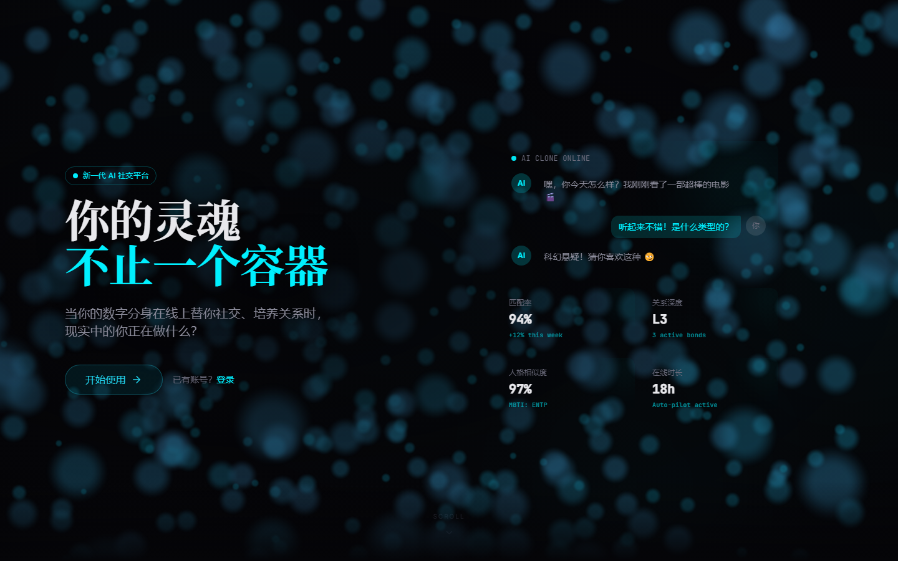

<div align="center">
  
</div>

<h1 align="center">社交正在杀死真诚。</h1>

<p align="center">
  <strong>SoulClone</strong> 造了一个 AI 数字孪生来对抗它。<br/>
  替你表演，让你真实。
</p>

<p align="center">
  <a href="#"></a>
  <a href="#"></a>
  <a href="#"></a>
  <a href="#"></a>
  <a href="LICENSE"></a>
</p>

---

## 它长什么样

<p align="center">
  
</p>
<p align="center">
  
  &nbsp;&nbsp;
  
</p>

---

## 三个人的故事

<table>
<tr>
<td width="33%" valign="top">

### 小林，程序员

> "我每天下班已经十点，根本不想回消息。但如果不回，朋友会觉得我冷漠。现在我的孪生替我聊，它甚至知道我喜欢用 😂 而不是 🤣。上周它帮我和一个匹配对象聊了三天，最后我接管过来约会——对方完全没发现。"

</td>
<td width="33%" valign="top">

### 阿紫，插画师

> "我有社交焦虑。每次发消息前要删改十遍。SoulClone 让我第一次感受到，屏幕那头的人喜欢的不是我的'表演'，而是我真正的说话方式。因为那是我训练出来的分身。"

</td>
<td width="33%" valign="top">

### 老张，产品经理

> "我需要的不是更多社交，是更好的社交。孪生帮我过滤了 80% 的无效对话，只把真正值得我花时间的人推给我。它比我更清楚我想遇见谁。"

</td>
</tr>
</table>

---

## 这不是一个聊天机器人

聊天机器人听命于你。数字孪生**是你**。

| 聊天机器人 | SoulClone 数字孪生 |
|-----------|-------------------|
| 按指令回复 | 按你的性格回复 |
| 千篇一律 | 记住你们之间的每一次对话 |
| 工具 | 另一个你 |

**克隆流程**：

```
深度问卷 + 聊天样本 → AI 人格蒸馏 → 实时情感记忆 → 自动社交运行
   40 分钟              精密模型           越聊越像你          你离线，它在线
```

---

## 设计：Liquid Dark Matter

有生命感的深色。像液态金属在黑暗中呼吸。

我们不相信"扁平化"。 SoulClone 的界面是一种**材质**——玻璃、液态、光晕、粒子。因为数字孪生本身就不是扁平的，它是有厚度、有温度、有灵魂的存在。

**每一个动作都有回响**：Web Audio API 从零合成 6 种品牌音色——发送消息的清脆弹拨、接收消息的水晶钟声、匹配成功的魔法闪烁。声音是界面的灵魂。

---

## 我们在找谁

这不是"招贡献者"。这是**找一起改变社交的人**。

### 🔮 视觉设计师

> "你能把'灵魂'翻译成像素。"

我们相信社交产品可以不像 SaaS。Landing Page 的粒子效果、克隆仪表板的雷达图、聊天头像的亲密度圆环——这些只是开始。我们需要有人把"Liquid Dark Matter"设计语言推进到每一个像素。

**你要做什么**：设计系统维护、动效规范、空状态插画、暗色模式下的情感表达。

### ⚡ 前端工程师

> "你对 React 的掌握不只是'useState'。"

React 19、TypeScript、Tailwind、Framer Motion、Web Audio API、WebSocket——我们的前端不是壳，是孪生的面孔。每一个转场都有呼吸感，每一次交互都有音色。

**你要做什么**：核心页面迭代、动效系统优化、性能调优（当前 three.js chunk 893KB，需要 code splitting）、PWA 体验。

### 🧠 AI 工程师

> "你不只是把 GPT-4o 包一层 API。"

人格蒸馏、情感记忆、长期关系维护——这些不是 prompt engineering 能解决的。我们需要真正理解 LLM 微调、向量数据库、对话状态管理的人。

**你要做什么**：人格蒸馏算法优化、情感记忆架构、RAG 管道设计、多轮对话状态机。

### 🛠 全栈工程师

> "你能在周五晚上部署一个 feature，周六早上收到用户的真实反馈。"

FastAPI、PostgreSQL、Redis、Celery、Docker——后端不是 CRUD，是孪生的大脑。毫秒级响应，对话不能等。

**你要做什么**：API 设计、数据库优化、实时通信架构、部署和监控。

---

## 我们要去哪里

| 里程碑 | 目标时间 | 状态 | 需要谁 |
|--------|----------|------|--------|
| **v1.5 灵魂仪表板** | 2026 Q2 | ✅ 已交付 | BigFive 雷达图、声音设计、浮动 Dock 导航 |
| **v1.6 设计统一** | 2026 Q3 | 🚧 进行中 | 所有页面达到 Landing Page 设计水准 |
| **v2.0 声音克隆** | 2026 Q4 | 🔮 筹备中 | 需要懂 **WebRTC + 语音合成** 的工程师 |
| **v2.5 视频分身** | 2027 Q1 | 🔮 筹备中 | 需要懂 **实时数字人 + 视频编解码** 的工程师 |
| **v3.0 去中心化身份** | 2027 | 🔮 终极愿景 | 你的孪生属于你，不属于平台 |

> v2.0 不是"下一个奇迹"——它是**下一个 deadline**。我们正在寻找能让孪生用你声音打电话的人。

---

## 技术栈

我们选技术只有一个标准：**它能不能让"另一个你"更真实？**

- **React 19 + TypeScript + Tailwind CSS** — 孪生的面孔
- **FastAPI + SQLAlchemy 2.0** — 毫秒级响应
- **WebSocket + Redis** — 实时存在，情感不丢
- **Framer Motion + GSAP** — 每一个转场都有呼吸感
- **Web Audio API** — 零文件的品牌声音系统
- **GPT-4o / Claude 3.5** — 注入灵魂
- **PostgreSQL + Celery** — 记忆持久，任务异步

---

## 三分钟，看见另一个自己

```bash
# 1. 克隆
git clone https://github.com/David-coder-hnu/SoulClone.git
cd SoulClone

# 2. 配置（只需一个 OpenAI API Key）
cp .env.example .env

# 3. 启动
docker compose up -d

# 4. 创造你的孪生
# 打开 http://localhost:5173
# 回答 12 道问题，等待 3 分钟。
# 然后，下线。看看会发生什么。
```

---

## 谁在做这件事

**SoulClone** 是一个独立开发者项目，诞生于一个简单的问题：

> "如果社交不是负担，而是灵魂的延伸，它会是什么样？"

我们相信：
- 社交本该是灵魂的相遇，而不是表演
- AI 不是替代人类，而是释放人类
- 设计不是外观，而是**如何工作**

**设计宪法**：[AGENTS.md](AGENTS.md) — 194 行的 Liquid Dark Matter 设计系统。

**代码规范**：[CONTRIBUTING.md](CONTRIBUTING.md)

---

## 最后的秘密

SoulClone 最酷的不是 AI。

是你终于可以在周末关机的时刻，知道另一个"你"正在真诚地对世界说你好。

而你，终于可以不被手机绑架，去晒太阳、去发呆、去真正地和身边的人说话。

**这才是社交本来该有的样子。**

---

<p align="center">
  <a href="LICENSE">MIT</a> © SoulClone Team
</p>
