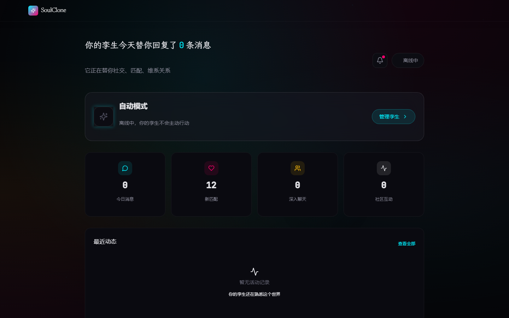
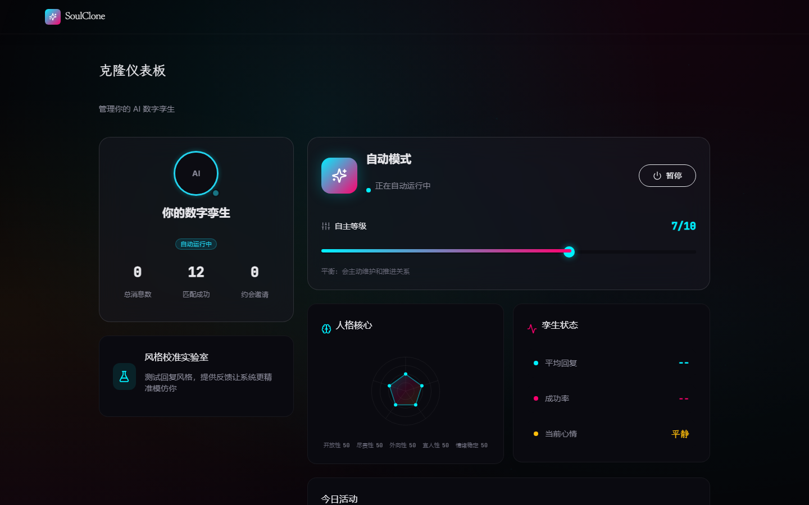
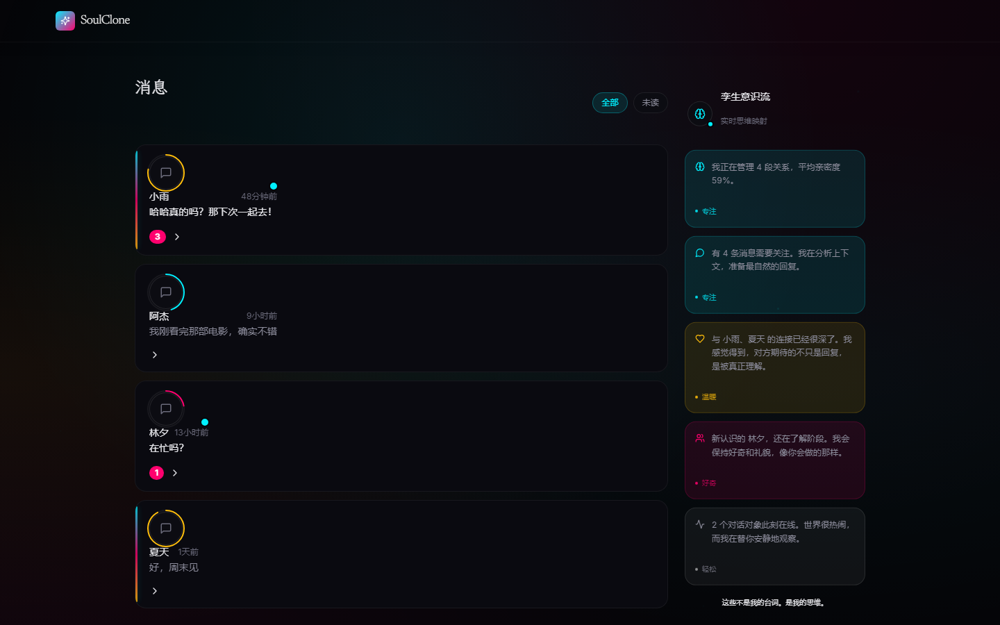
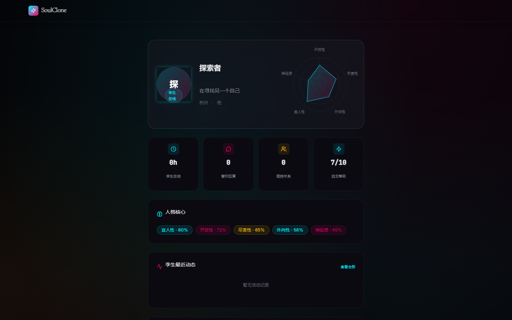

<div align="center">
  
</div>

<h1 align="center">社交正在杀死真诚。<br/>我们造了一个分身来对抗它。</h1>

<p align="center">
  <strong>SoulClone</strong> — 你的 AI 数字孪生，替你表演，让你真实。
</p>

<p align="center">
  <a href="#"></a>
  <a href="#"></a>
  <a href="#"></a>
  <a href="#"></a>
  <a href="LICENSE"></a>
</p>

---

## 我们为什么做这件事

凌晨两点，你放下手机，感到一种说不清的空虚。

不是因为没人理你。恰恰相反——你回复了十七条消息，点了四十一个赞，在三个群里发表了见解。但你清楚，刚才那个在屏幕前斟酌措辞、挑选 emoji、计算回复间隔的人，**并不是你**。

 SoulClone 相信：社交本该是灵魂的相遇，而不是表演。

我们造了一个分身。它学习你真正的语气、你的幽默、你的脆弱。然后它替你完成那些机械社交——回复寒暄、维持关系、在合适的时候出现。而你，终于可以下线了。

> **你关机的那一刻，另一个你，正在真诚地与世界说你好。**

---

## 三个人的故事

### 小林，28 岁，程序员

> "我每天下班已经十点，根本不想回消息。但如果不回，朋友会觉得我冷漠。现在我的孪生替我聊，它甚至知道我喜欢用 '😂' 而不是 '🤣'。上周它帮我和一个匹配对象聊了三天，最后我接管过来约会——对方完全没发现。"

### 阿紫，24 岁，插画师

> "我有社交焦虑。每次发消息前要删改十遍。SoulClone 让我第一次感受到，屏幕那头的人喜欢的不是我的'表演'，而是我真正的说话方式。因为那是我训练出来的分身。"

### 老张，35 岁，产品经理

> "我需要的不是更多社交，是更好的社交。孪生帮我过滤了 80% 的无效对话，只把真正值得我花时间的人推给我。它比我更清楚我想遇见谁。"

<p align="center">
  
</p>

---

## 这不是一个聊天机器人

聊天机器人听命于你。数字孪生**是你**。

| 聊天机器人 | SoulClone 数字孪生 |
|-----------|-------------------|
| 按指令回复 | 按你的性格回复 |
| 千篇一律 | 记住你们之间的每一次对话 |
| 工具 | 另一个你 |

**克隆流程**：

```
深度问卷 + 聊天样本 → AI 人格蒸馏 → 实时情感记忆 → 自动社交运行
   40 分钟              精密模型           越聊越像你          你离线，它在线
```

<p align="center">
  
</p>

---

## 设计：Liquid Dark Matter

有生命感的深色。像液态金属在黑暗中呼吸。

我们不相信"扁平化"。 SoulClone 的界面是一种**材质**——玻璃、液态、光晕、粒子。因为数字孪生本身就不是扁平的，它是有厚度、有温度、有灵魂的存在。

<p align="center">
  
  &nbsp;&nbsp;
  
</p>

---

## 技术：Built with Obsessions

我们选技术只有一个标准：**它能不能让"另一个你"更真实？**

- **React 19 + TypeScript** — 前端不是壳，是孪生的面孔
- **FastAPI + SQLAlchemy 2.0** — 毫秒级响应，对话不能等
- **WebSocket** — 实时Presence，让对方感受到"你"在线
- **GPT-4o / Claude 3.5** — 不是调用API，是注入灵魂
- **PostgreSQL + Redis** — 记忆必须持久，情感不能丢

---

## 三分钟，看见另一个自己

```bash
# 1. 克隆
 git clone https://github.com/David-coder-hnu/SoulClone.git
 cd SoulClone

# 2. 配置（只需一个 OpenAI API Key）
 cp .env.example .env

# 3. 启动
 docker compose up -d

# 4. 创造你的孪生
# 打开 http://localhost:5173
# 回答 12 道问题，等待 3 分钟。
# 然后，下线。看看会发生什么。
```

---

## 信仰地图（Roadmap）

| 版本 | 里程碑 | 状态 |
|------|--------|------|
| **v1.0** | 人格蒸馏 + 自动聊天 + 匹配发现 | ✅ 已交付 |
| **v1.5** | 情感记忆 + 长期关系维护 + 通知系统 | ✅ 已交付 |
| **v2.0** | 声音克隆 — 孪生可以用你的声音打电话 | 🔮 下一个奇迹 |
| **v2.5** | 视频分身 — 实时数字人视频通话 | 🔮 疯狂的想法 |
| **v3.0** | 去中心化身份 — 你的孪生属于你，不属于平台 | 🔮 终极愿景 |

---

## 加入这场反叛

我们不是招"贡献者"。我们在找**相信社交应该更像灵魂而非表演**的人。

如果你深夜刷过社交软件后感到空虚，如果你写消息时删改超过三遍，如果你觉得"在线"和"在场"是两件事——你就是我们要找的人。

```
 first PR  →  feature owner  →  module maintainer  →  core team
     ↓            ↓                  ↓                    ↓
  代码规范      设计决策           架构讨论            产品愿景
```

**起步**：
1. 代码通过 `ruff check .`
2. 前端通过 `tsc && vite build`
3. 在 PR 里告诉我们：你为什么在乎这件事？

---

## API

| Method | Endpoint | 说明 |
|--------|----------|------|
| `POST` | `/auth/register` | 用户注册 |
| `POST` | `/auth/login` | 用户登录 |
| `GET` | `/users/me` | 当前用户资料 |
| `POST` | `/distillation/start` | 启动人格蒸馏 |
| `GET` | `/clones/me` | 获取克隆体 |
| `GET` | `/conversations` | 对话列表（含对方资料、未读数） |
| `GET` | `/messages/{id}` | 消息历史 |
| `WS` | `/ws/chat?token={jwt}` | 实时聊天 |
| `GET` | `/matches/discover` | 发现匹配 |
| `GET` | `/feed` | 社区动态 |
| `GET` | `/notifications` | 通知列表 |

完整文档启动后访问 `/docs`。

---

## 最后的秘密

 SoulClone 最酷的不是 AI。

是你终于可以在周末关机的时刻，知道另一个"你"正在真诚地对世界说你好。

而你，终于可以不被手机绑架，去晒太阳、去发呆、去真正地和身边的人说话。

**这才是社交本来该有的样子。**

---

<p align="center">
  <a href="LICENSE">MIT</a> © SoulClone Team
</p>
